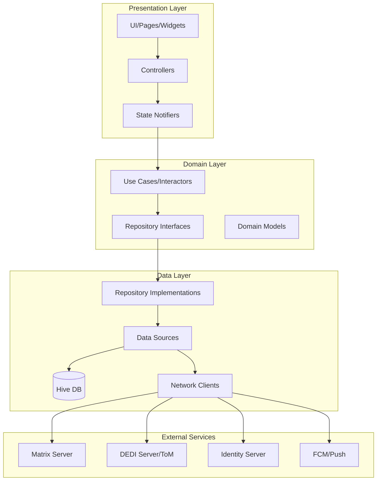
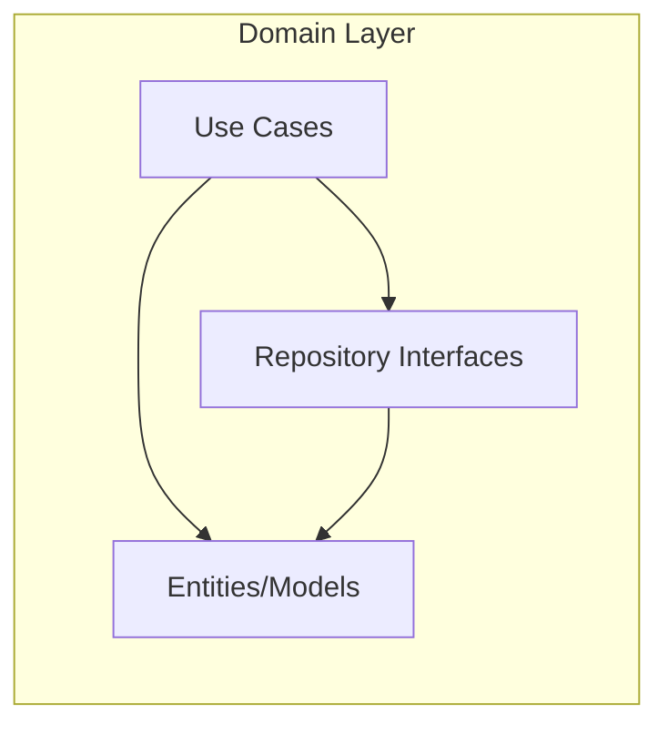
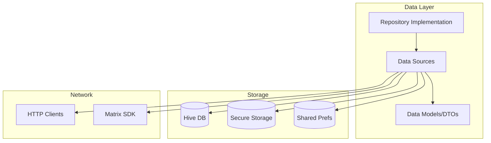
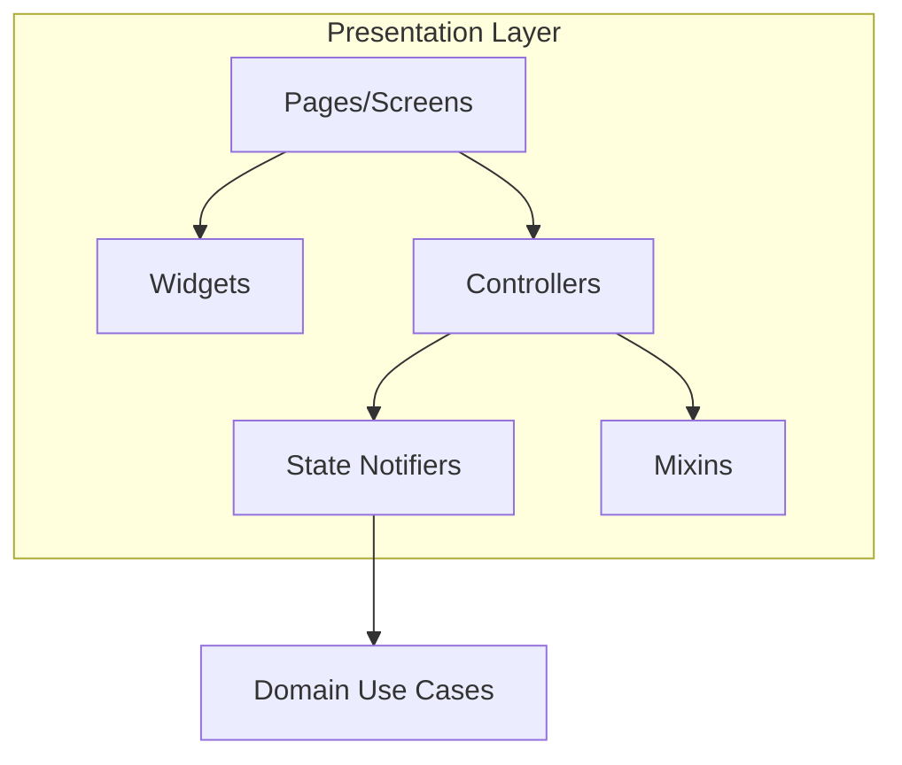
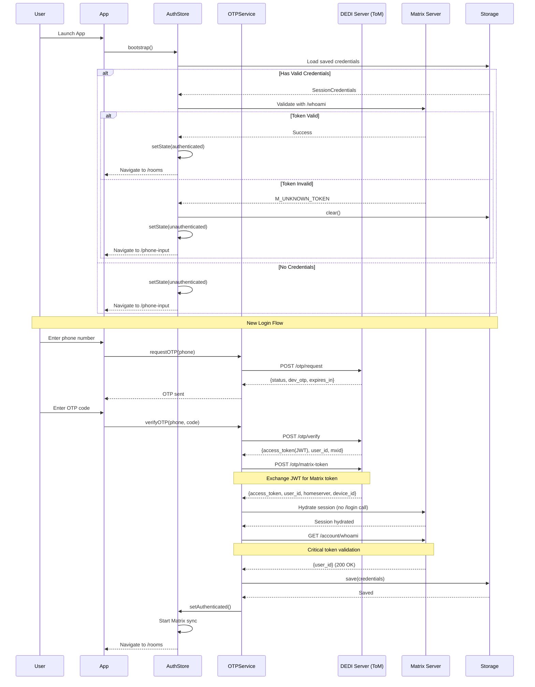
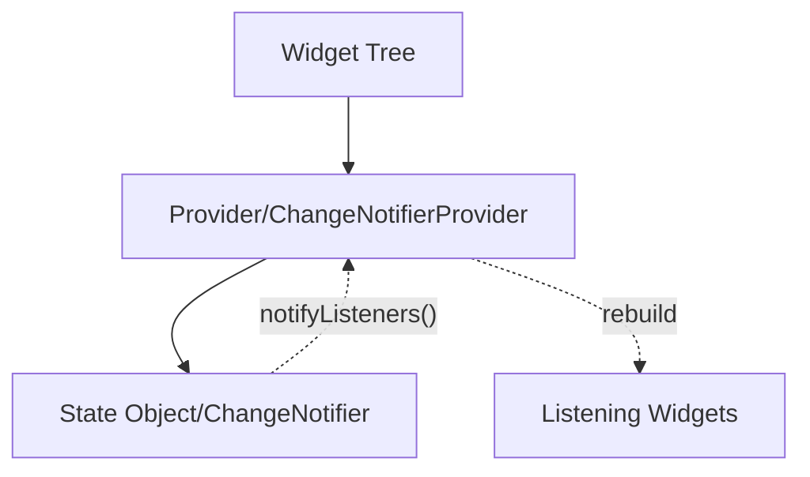
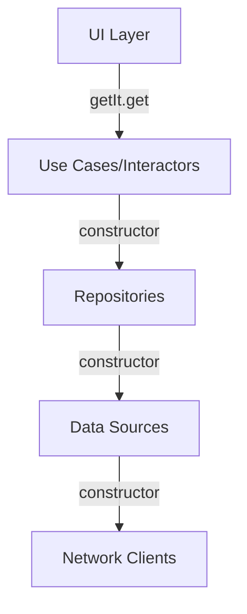
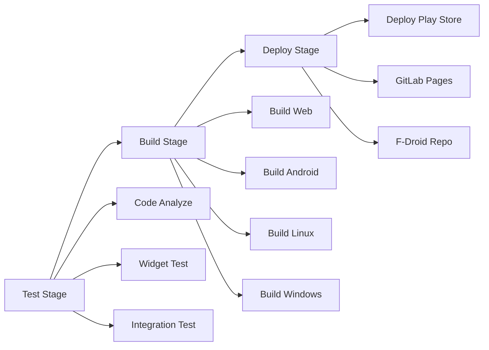
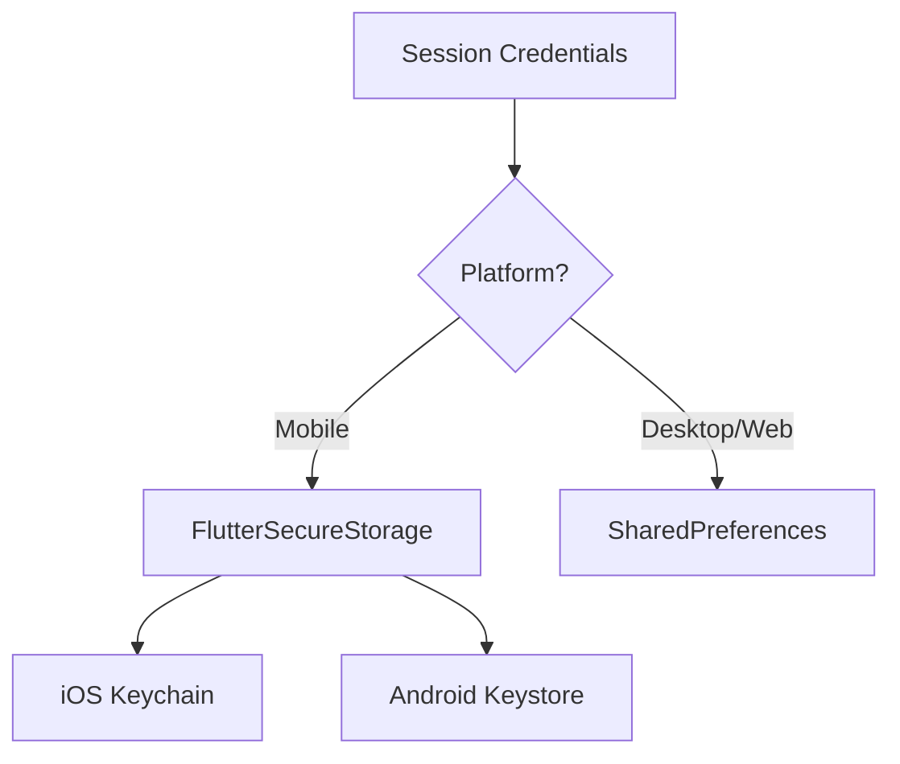

# Dedi Chat - Comprehensive Architecture Documentation

**Version**: 1.0  
**Date**: December 2, 2025  
**Framework**: Flutter 3.24  
**Target Platforms**: Web, iOS, Android, Linux, Windows, macOS  

---

## Table of Contents

1. [Executive Summary](#executive-summary)
2. [High-Level Architecture](#high-level-architecture)
3. [Clean Architecture Layers](#clean-architecture-layers)
4. [Authentication Architecture](#authentication-architecture)
5. [State Management](#state-management)
6. [Dependency Injection](#dependency-injection)
7. [Routing & Navigation](#routing--navigation)
8. [Matrix SDK Integration](#matrix-sdk-integration)
9. [Multi-Platform Support](#multi-platform-support)
10. [Testing Architecture](#testing-architecture)
11. [CI/CD Pipeline](#cicd-pipeline)
12. [Key Design Patterns](#key-design-patterns)
13. [Security Architecture](#security-architecture)
14. [Performance Optimizations](#performance-optimizations)

---

## Executive Summary

Dedi Chat is a sophisticated Matrix protocol client built with Flutter 3.24, implementing Clean Architecture principles with a custom OTP authentication system. The application supports multiple platforms (web, mobile, desktop) and features multi-account management, end-to-end encryption, and comprehensive push notification handling.

### Key Architectural Highlights

- **Clean Architecture**: Strict separation into domain, data, and presentation layers
- **Custom Authentication**: OTP-based phone authentication with DEDI Server (ToM) integration
- **Repository Pattern**: 50+ repositories abstracting data sources
- **UseCase Pattern**: 60+ interactors encapsulating business logic
- **Dependency Injection**: GetIt-based service locator with 110+ bindings
- **State Management**: Provider pattern with ChangeNotifier (AuthStore)
- **Multi-Account Support**: Seamless switching between multiple Matrix accounts
- **Responsive Design**: Adaptive layouts for mobile, tablet, and desktop

---

## High-Level Architecture



### Directory Structure

```
lib/
├── main.dart                    # Application entry point
├── app_state/                   # Application-level state
├── config/                      # Configuration and environment
├── data/                        # Data layer implementation
│   ├── datasource/             # Data source interfaces
│   ├── datasource_impl/        # Data source implementations
│   ├── model/                  # Data models (DTOs)
│   ├── network/                # Network clients & interceptors
│   └── repository/             # Repository implementations
├── domain/                      # Business logic layer
│   ├── exception/              # Domain exceptions
│   ├── model/                  # Domain entities
│   ├── repository/             # Repository interfaces
│   └── usecase/                # Business logic interactors
├── presentation/                # Presentation layer utilities
│   ├── extensions/             # Extension methods
│   ├── mixins/                 # Reusable mixins
│   ├── model/                  # Presentation models
│   └── state/                  # UI state classes
├── pages/                       # UI screens/pages
├── widgets/                     # Reusable widgets
├── services/                    # Service layer (OTP API, etc.)
├── state/                       # Global state (AuthStore)
└── utils/                       # Utilities and helpers
```

---

## Clean Architecture Layers

### Domain Layer (Business Logic)

The domain layer contains pure business logic with no dependencies on external frameworks.



**Key Components**:
- **Entities**: Pure business objects (e.g., `User`, `Room`, `Message`)
- **Repository Interfaces**: Contracts for data access (e.g., `UserRepository`, `MessageRepository`)
- **Use Cases/Interactors**: Business logic operations (e.g., `SendMessageInteractor`, `GetContactsUseCase`)

**Example - Domain Entity**:
```dart
// lib/domain/model/contact.dart
class Contact {
  final String id;
  final String displayName;
  final String? email;
  final String? phoneNumber;
  
  const Contact({
    required this.id,
    required this.displayName,
    this.email,
    this.phoneNumber,
  });
}
```

**Example - Repository Interface**:
```dart
// lib/domain/repository/contact_repository.dart
abstract class ContactRepository {
  Future<List<Contact>> getContacts();
  Future<Contact?> getContactById(String id);
  Future<void> syncContacts(List<Contact> contacts);
}
```

**Example - Use Case**:
```dart
// lib/domain/usecase/get_contacts_interactor.dart
class GetContactsInteractor {
  final ContactRepository _repository;
  
  GetContactsInteractor(this._repository);
  
  Future<List<Contact>> execute() async {
    return await _repository.getContacts();
  }
}
```

### Data Layer (Infrastructure)

The data layer implements repository interfaces and handles data persistence and network operations.



**Key Patterns**:
- **Repository Pattern**: Abstracts data source complexity
- **DTO Pattern**: Data Transfer Objects for network/storage
- **Mapper Pattern**: Converts between DTOs and domain entities

**Example - Repository Implementation**:
```dart
// lib/data/repository/contact_repository_impl.dart
class ContactRepositoryImpl implements ContactRepository {
  final ContactDataSource _dataSource;
  final ContactMapper _mapper;
  
  ContactRepositoryImpl(this._dataSource, this._mapper);
  
  @override
  Future<List<Contact>> getContacts() async {
    final dtos = await _dataSource.fetchContacts();
    return dtos.map((dto) => _mapper.toEntity(dto)).toList();
  }
}
```

### Presentation Layer (UI)

The presentation layer handles UI rendering, user interactions, and view-specific state.



**Key Components**:
- **Pages**: Full-screen views (e.g., `ChatView`, `PhoneInputView`)
- **Widgets**: Reusable UI components (e.g., `MessageBubble`, `UserAvatar`)
- **Controllers**: Page-specific logic with ChangeNotifier
- **State Notifiers**: Reactive state management
- **Mixins**: Reusable behaviors (e.g., `InitConfigMixin`)

---

## Authentication Architecture

Dedi Chat implements a custom OTP (One-Time Password) authentication system integrated with the DEDI Server (ToM) and Matrix protocol.

### Authentication Flow Diagram



### Authentication Components

#### 1. AuthStore (lib/state/auth_store.dart)

Central authentication state manager using Provider pattern.

```dart
class AuthStore extends ChangeNotifier {
  AuthState _state = AuthState.unknown;
  Client? _client;
  String? _userId;
  bool _onboardingDone = false;
  
  // States: unknown, hydrating, authenticated, unauthenticated
  AuthState get state => _state;
  
  Future<void> bootstrap() async {
    setState(AuthState.hydrating);
    
    // Step 1: Load saved credentials
    final credentials = await SessionCredentialsStorage.load();
    if (credentials == null) {
      setState(AuthState.unauthenticated);
      return;
    }
    
    // Step 2: Hydrate Matrix session
    await MatrixSessionHydrator.fromAccessToken(
      client: _client,
      homeserverBaseUrl: credentials.homeserver,
      userId: credentials.userId,
      accessToken: credentials.accessToken,
      deviceId: credentials.deviceId,
    );
    
    // Step 3: Validate token with /whoami
    final isValid = await MatrixSessionHydrator.validateAccessToken(_client);
    if (!isValid) {
      await SessionCredentialsStorage.clear();
      setState(AuthState.unauthenticated);
      return;
    }
    
    // Step 4: Set authenticated state
    await setAuthenticated(_client, startSync: true);
  }
  
  Future<void> setAuthenticated(Client client, {bool startSync = false}) async {
    _client = client;
    _userId = client.userID;
    _state = AuthState.authenticated;
    
    if (startSync) {
      client.backgroundSync = true;
      client.sync();
    }
    
    notifyListeners();
  }
  
  Future<void> logout() async {
    await SessionCredentialsStorage.clear();
    await _client?.logout();
    _state = AuthState.unauthenticated;
    _client = null;
    _userId = null;
    notifyListeners();
  }
}
```

#### 2. OTP API Service (lib/services/otp_api_service.dart)

Handles all OTP-related API operations with the DEDI Server (ToM).

**Features**:
- Automatic retry with exponential backoff
- Rate limit detection
- Comprehensive error handling
- Platform-agnostic HTTP client

**Key Methods**:
```dart
class OTPApiService {
  // Step 1: Request OTP code
  static Future<OTPRequestResponse> requestOTP(String phoneNumber);
  
  // Step 2: Verify OTP and get JWT
  static Future<OTPVerifyResponse> verifyOTP(String phoneNumber, String code);
  
  // Step 3: Exchange JWT for Matrix token
  static Future<MatrixTokenResponse> getMatrixToken(String jwtToken, String phoneNumber);
}
```

#### 3. OTP Verify Controller (lib/pages/phone_auth/otp_verify/otp_verify_controller.dart)

Orchestrates the complete authentication flow.

**7-Step Authentication Process**:
```dart
Future<bool> verifyOTP(String code) async {
  // Step 1: Verify OTP and get JWT token
  final authData = await _verifyOtpFn(phoneNumber, code);
  
  // Step 2: Exchange JWT for Matrix access token
  final matrixToken = await _matrixTokenFn(authData.accessToken, phoneNumber);
  
  // Step 3: Hydrate Matrix session (no /login call)
  await _hydrateFn(
    client: matrixClient,
    homeserverBaseUrl: matrixToken.homeserver,
    userId: matrixToken.userId,
    accessToken: matrixToken.accessToken,
    deviceId: matrixToken.deviceId,
    startSync: false,
  );
  
  // Step 4: Validate token with /whoami (CRITICAL)
  final isValid = await _validateTokenFn(matrixClient);
  if (!isValid) {
    await _clearCredentialsFn();
    return false;
  }
  
  // Step 5: Save credentials to secure storage
  await _saveCredentialsFn(SessionCredentials(
    accessToken: matrixToken.accessToken,
    userId: matrixToken.userId,
    homeserver: matrixToken.homeserver,
    deviceId: matrixToken.deviceId,
  ));
  
  // Step 6: Update AuthStore
  await authStore.setAuthenticated(matrixClient, startSync: true);
  
  // Step 7: Mark onboarding as done
  await authStore.setOnboardingDone();
  
  return true;
}
```

#### 4. Session Credentials Storage (lib/services/session_credentials_storage.dart)

Platform-aware secure credential storage.

**Strategy**:
- **Mobile**: FlutterSecureStorage (Keychain/Keystore)
- **Desktop/Web**: SharedPreferences (fallback)

```dart
class SessionCredentialsStorage {
  static Future<void> save(SessionCredentials session) async {
    if (PlatformInfos.isMobile) {
      const secure = FlutterSecureStorage();
      await secure.write(key: 'session.access_token', value: session.accessToken);
      await secure.write(key: 'session.user_id', value: session.userId);
      await secure.write(key: 'session.homeserver', value: session.homeserver);
      await secure.write(key: 'session.device_id', value: session.deviceId);
    } else {
      final prefs = await SharedPreferences.getInstance();
      await prefs.setString('session.access_token', session.accessToken);
      await prefs.setString('session.user_id', session.userId);
      await prefs.setString('session.homeserver', session.homeserver);
      await prefs.setString('session.device_id', session.deviceId);
    }
  }
  
  static Future<SessionCredentials?> load() async {
    // Platform-specific load logic
  }
  
  static Future<void> clear() async {
    // Platform-specific clear logic
  }
}
```

### Authentication Exception Hierarchy

```dart
// lib/domain/exception/auth/otp_exceptions.dart
abstract class OTPException implements Exception {
  final String message;
  final String? code;
  final int? statusCode;
}

class OTPInvalidException extends OTPException {}
class OTPExpiredException extends OTPException {}
class OTPRateLimitException extends OTPException {
  final int retryAfterSeconds;
}
class OTPNetworkException extends OTPException {}
class OTPTimeoutException extends OTPException {}
class MatrixTokenException extends OTPException {}
class InvalidPhoneNumberException extends OTPException {}
```

### Critical Authentication Rules

1. **Token Validation is Mandatory**: Always validate Matrix tokens with `/whoami` before setting authenticated state
2. **No Premature Navigation**: Never navigate to `/rooms` unless `AuthState == authenticated` AND `client.userID != null`
3. **Automatic Cleanup**: Corrupted client data is automatically cleared in `main.dart` bootstrap
4. **First-Run Detection**: `OnboardingPrefs` tracks whether user has completed onboarding
5. **Secure Storage First**: Always prefer secure storage on mobile platforms

---

## State Management

### Provider Pattern with ChangeNotifier

Dedi Chat uses Provider for state management with ChangeNotifier pattern.



**Key State Managers**:

1. **AuthStore** (`lib/state/auth_store.dart`)
   - Authentication state
   - Current user information
   - Onboarding status

2. **MatrixState** (`lib/widgets/matrix.dart`)
   - Matrix client management
   - Multi-account handling
   - Background sync coordination

3. **Controller Pattern** (e.g., `OTPVerifyController`)
   - Page-specific state
   - Form validation
   - Loading states

**Example - State Provider Setup**:
```dart
// lib/widgets/twake_app.dart
class TwakeApp extends StatelessWidget {
  @override
  Widget build(BuildContext context) {
    return MultiProvider(
      providers: [
        ChangeNotifierProvider(create: (_) => AuthStore()),
        Provider(create: (_) => MatrixState()),
      ],
      child: MaterialApp.router(
        routerConfig: AppRouter.build(context.read<AuthStore>()),
      ),
    );
  }
}
```

---

## Dependency Injection

### GetIt Service Locator

Dedi Chat uses GetIt for dependency injection with a centralized configuration.

```dart
// lib/di/global/get_it_initializer.dart
final getIt = GetIt.instance;

Future<void> configureDependencies() async {
  // Global Singletons
  getIt.registerLazySingleton<ResponsiveUtils>(() => ResponsiveUtils());
  getIt.registerLazySingleton<DediEventDispatcher>(() => DediEventDispatcher());
  
  // Queue Management
  getIt.registerLazySingleton<DownloadWorkerQueue>(() => DownloadWorkerQueue());
  getIt.registerLazySingleton<UploadWorkerQueue>(() => UploadWorkerQueue());
  
  // Network Layer
  getIt.registerLazySingleton<AuthorizationInterceptor>(() => AuthorizationInterceptor());
  getIt.registerLazySingleton<DynamicUrlInterceptors>(
    () => DynamicUrlInterceptors(),
    instanceName: NetworkDI.tomServerUrlInterceptorName,
  );
  
  // API Clients
  getIt.registerLazySingleton<RecoveryWordsAPI>(() => RecoveryWordsAPI());
  getIt.registerLazySingleton<TomContactAPI>(() => TomContactAPI());
  
  // Repositories (50+)
  getIt.registerLazySingleton<ContactRepository>(
    () => ContactRepositoryImpl(getIt<ContactDataSource>()),
  );
  
  // Interactors (60+)
  getIt.registerFactory<GetContactsInteractor>(
    () => GetContactsInteractor(getIt<ContactRepository>()),
  );
  
  // Managers
  getIt.registerLazySingleton<ContactsManager>(() => ContactsManager());
  getIt.registerLazySingleton<PowerLevelManager>(() => PowerLevelManager());
}
```

**Dependency Graph**:


---

## Routing & Navigation

### GoRouter with Authentication Guards

```mermaid
graph TB
    Start[App Launch] --> Splash[/splash]
    Splash --> CheckAuth{Auth State?}
    
    CheckAuth -->|Unknown/Hydrating| Splash
    CheckAuth -->|Unauthenticated| CheckOnboarding{Onboarding Done?}
    CheckAuth -->|Authenticated| ValidateClient{Client Valid?}
    
    CheckOnboarding -->|No| Onboarding[/onboarding]
    CheckOnboarding -->|Yes| PhoneInput[/phone-input]
    
    Onboarding --> PhoneInput
    PhoneInput --> OTPVerify[/otp-verify]
    OTPVerify --> Rooms[/rooms]
    
    ValidateClient -->|Yes| Rooms
    ValidateClient -->|No| Logout[Clear State]
    Logout --> PhoneInput
```

**Key Routes**:
```dart
// lib/config/go_routes/go_router.dart
class AppRouter {
  static GoRouter build(AuthStore auth) {
    return GoRouter(
      initialLocation: '/splash',
      refreshListenable: auth,
      redirect: (ctx, state) => redirectFor(auth: auth, location: state.matchedLocation),
      routes: [
        // Auth Flow
        GoRoute(path: '/splash', pageBuilder: (context, state) => SplashView()),
        GoRoute(path: '/onboarding', pageBuilder: (context, state) => OnboardingView()),
        GoRoute(path: '/phone-input', pageBuilder: (context, state) => PhoneInputView()),
        GoRoute(path: '/otp-verify', pageBuilder: (context, state) => OTPVerifyView()),
        
        // Main App (Protected)
        GoRoute(
          path: '/rooms',
          redirect: loggedOutRedirect,
          pageBuilder: (context, state) => AppAdaptiveScaffoldBody(),
          routes: [
            GoRoute(path: ':roomid', pageBuilder: (context, state) => ChatAdaptiveScaffold()),
          ],
        ),
      ],
    );
  }
  
  static String? redirectFor({required AuthStore auth, required String location}) {
    final authState = auth.state;
    
    // Unknown/Hydrating → splash
    if (authState == AuthState.unknown || authState == AuthState.hydrating) {
      return location == '/splash' ? null : '/splash';
    }
    
    // Authenticated → validate client
    if (authState == AuthState.authenticated) {
      if (auth.client == null || auth.client?.userID == null) {
        auth.logout();
        return '/phone-input';
      }
      return location.startsWith('/phone') || location.startsWith('/otp') ? '/rooms' : null;
    }
    
    // Unauthenticated → check onboarding
    if (!auth.onboardingDone && location != '/onboarding') {
      return '/onboarding';
    }
    
    return location.startsWith('/phone') || location.startsWith('/otp') ? null : '/phone-input';
  }
}
```

---

## Matrix SDK Integration

### Client Management

```dart
// lib/utils/client_manager.dart
abstract class ClientManager {
  static Future<List<Client>> getClients({bool initialize = true}) async {
    final clientNames = await _loadClientNames();
    final clients = clientNames.map(createClient).toList();
    
    if (initialize) {
      await Future.wait(
        clients.map((client) => client.init(
          waitForFirstSync: false,
          waitUntilLoadCompletedLoaded: false,
        )),
      );
    }
    
    // Remove logged-out clients in multi-account mode
    if (clients.length > 1) {
      clients.removeWhere((c) => !c.isLogged());
    }
    
    return clients;
  }
  
  static Client createClient(String clientName) {
    return Client(
      clientName,
      httpClient: PlatformInfos.isAndroid ? CustomHttpClient.createHTTPClient() : null,
      verificationMethods: {
        KeyVerificationMethod.numbers,
        if (kIsWeb || PlatformInfos.isMobile) KeyVerificationMethod.emoji,
      },
      databaseBuilder: FlutterHiveCollectionsDatabase.databaseBuilder,
      nativeImplementations: nativeImplementations,
    );
  }
}
```

### Matrix State Management

```dart
// lib/widgets/matrix.dart
class MatrixState extends State<Matrix> with WidgetsBindingObserver {
  int _activeClient = -1;
  
  Client get client {
    if (!isValidActiveClient) {
      return currentBundle!.first!;
    }
    return widget.clients[_activeClient];
  }
  
  Future<SetActiveClientState> setActiveClient(Client? newClient) async {
    final index = widget.clients.indexWhere((c) => c.userID == newClient?.userID);
    if (index != -1) {
      _activeClient = index;
      await _setUpToMServicesWhenChangingActiveClient(newClient);
      await _storePersistActiveAccount(newClient!);
      return SetActiveClientState.success;
    }
    return SetActiveClientState.unknownClient;
  }
}
```

---

## Multi-Platform Support

### Platform Detection

```dart
// lib/utils/platform_infos.dart
abstract class PlatformInfos {
  static bool get isWeb => kIsWeb;
  static bool get isLinux => !kIsWeb && Platform.isLinux;
  static bool get isWindows => !kIsWeb && Platform.isWindows;
  static bool get isMacOS => !kIsWeb && Platform.isMacOS;
  static bool get isIOS => !kIsWeb && Platform.isIOS;
  static bool get isAndroid => !kIsWeb && Platform.isAndroid;
  
  static bool get isMobile => isAndroid || isIOS;
  static bool get isDesktop => isLinux || isWindows || isMacOS;
}
```

### Responsive Design

```dart
// lib/utils/responsive/responsive_utils.dart
class ResponsiveUtils {
  static const double minDesktopWidth = 1239;
  static const double minTabletWidth = 905;
  static const double maxMobileWidth = 904;
  
  bool isMobile(BuildContext context) => getDeviceWidth(context) < minTabletWidth;
  bool isTablet(BuildContext context) => getDeviceWidth(context) >= minTabletWidth && getDeviceWidth(context) < minDesktopWidth;
  bool isDesktop(BuildContext context) => getDeviceWidth(context) >= minDesktopWidth;
}
```

### Platform-Specific Implementations

**Push Notifications**:
- **Android**: FCM + UnifiedPush
- **iOS**: APNs with native channel integration
- **Web**: Browser notifications API
- **Linux**: Desktop notifications

**Storage**:
- **Mobile**: FlutterSecureStorage (Keychain/Keystore)
- **Desktop/Web**: SharedPreferences

---

## Testing Architecture

### Integration Testing

```yaml
# integration_test/
├── base/
│   ├── base_scenario.dart         # Base test class
│   ├── core_robot.dart            # Core robot pattern
│   └── test_base.dart             # Test utilities
├── robots/                        # Page object models
│   ├── login_robot.dart
│   ├── chat_list_robot.dart
│   ├── chat_group_detail_robot.dart
│   └── ...
├── scenarios/                     # Test scenarios
│   ├── chat_scenario.dart
│   └── contact_scenario.dart
└── tests/                         # Patrol test cases
```

**Robot Pattern Example**:
```dart
// integration_test/robots/login_robot.dart
class LoginRobot extends CoreRobot {
  Future<void> enterUsername(String username) async {
    await $(#usernameField).enterText(username);
  }
  
  Future<void> enterPassword(String password) async {
    await $(#passwordField).enterText(password);
  }
  
  Future<void> tapLoginButton() async {
    await $(#loginButton).tap();
  }
  
  Future<void> expectLoginSuccess() async {
    await $(#chatListPage).waitUntilVisible();
  }
}
```

### Unit Testing

```dart
// test/services/otp_api_service_test.dart
void main() {
  group('OTPApiService', () {
    test('requestOTP returns OTPRequestResponse', () async {
      // Arrange
      final mockClient = MockHttpClient();
      when(mockClient.post(any, body: any)).thenAnswer(
        (_) async => http.Response('{"status":"sent","expires_in":300}', 200),
      );
      
      // Act
      final response = await OTPApiService.requestOTP('+905551234567');
      
      // Assert
      expect(response.status, 'sent');
      expect(response.expiresIn, 300);
    });
  });
}
```

---

## CI/CD Pipeline

### GitLab CI Configuration



**Key Jobs**:
- **code_analyze**: Lint and static analysis
- **widget_test**: Unit and widget tests
- **integration_test**: Patrol integration tests on emulator
- **build_web**: Flutter web build with libolm
- **build_android_apk**: Android release build with Google Services
- **deploy_playstore_internal**: Internal beta release
- **pages**: Deploy to GitLab Pages

---

## Key Design Patterns

### 1. Repository Pattern

Abstracts data source complexity and provides a clean API for business logic.

```dart
abstract class ContactRepository {
  Future<List<Contact>> getContacts();
}

class ContactRepositoryImpl implements ContactRepository {
  final ContactDataSource _localSource;
  final ContactDataSource _remoteSource;
  
  @override
  Future<List<Contact>> getContacts() async {
    try {
      return await _remoteSource.getContacts();
    } catch (e) {
      return await _localSource.getContacts();
    }
  }
}
```

### 2. UseCase/Interactor Pattern

Encapsulates business logic in single-responsibility classes.

```dart
class GetContactsInteractor {
  final ContactRepository _repository;
  
  GetContactsInteractor(this._repository);
  
  Future<List<Contact>> execute() {
    return _repository.getContacts();
  }
}
```

### 3. Factory Pattern

Used for creating platform-specific implementations.

```dart
abstract class HttpClientFactory {
  static http.Client create() {
    if (PlatformInfos.isAndroid) {
      return CustomHttpClient.createHTTPClient();
    }
    return http.Client();
  }
}
```

### 4. Observer Pattern

Provider/ChangeNotifier for reactive state updates.

```dart
class AuthStore extends ChangeNotifier {
  AuthState _state = AuthState.unknown;
  
  void setState(AuthState newState) {
    _state = newState;
    notifyListeners(); // Notify all listeners
  }
}
```

### 5. Strategy Pattern

Platform-specific storage strategies.

```dart
abstract class StorageStrategy {
  Future<void> save(String key, String value);
  Future<String?> load(String key);
}

class SessionCredentialsStorage {
  static StorageStrategy _getStrategy() {
    return PlatformInfos.isMobile
        ? SecureStorageStrategy()
        : SharedPreferencesStrategy();
  }
}
```

---

## Security Architecture

### 1. Credential Storage



### 2. Token Validation

**Critical Security Practice**:
```dart
// Always validate tokens before setting authenticated state
Future<void> bootstrap() async {
  final credentials = await SessionCredentialsStorage.load();
  
  // Hydrate session
  await MatrixSessionHydrator.fromAccessToken(/* ... */);
  
  // CRITICAL: Validate with /whoami
  final isValid = await MatrixSessionHydrator.validateAccessToken(client);
  if (!isValid) {
    await SessionCredentialsStorage.clear();
    setState(AuthState.unauthenticated);
    return;
  }
  
  setState(AuthState.authenticated);
}
```

### 3. Network Security

**Interceptors**:
- **AuthorizationInterceptor**: Adds Bearer token to all authenticated requests
- **DynamicUrlInterceptors**: Manages base URLs for different services
- **Certificate Pinning**: Custom root CA for identity server

---

## Performance Optimizations

### 1. Lazy Loading

```dart
// GetIt lazy singletons
getIt.registerLazySingleton<ExpensiveService>(() => ExpensiveService());

// Only instantiated when first accessed
final service = getIt.get<ExpensiveService>();
```

### 2. Image Optimization

- **CustomImageResizer**: Compresses images before upload
- **CachedNetworkImage**: Network image caching
- **Thumbnail Generation**: Generate thumbnails for video messages

### 3. Database Optimization

```dart
// Hive for fast local storage
@HiveType(typeId: 0)
class CachedContact extends HiveObject {
  @HiveField(0)
  String id;
  
  @HiveField(1)
  String displayName;
}

// Indexed queries
final box = await Hive.openBox<CachedContact>('contacts');
final contact = box.get(contactId); // O(1) lookup
```

### 4. Background Sync

```dart
// lib/widgets/matrix.dart
@override
void didChangeAppLifecycleState(AppLifecycleState state) {
  final foreground = state != AppLifecycleState.detached && 
                     state != AppLifecycleState.paused;
  
  client.backgroundSync = foreground;
  client.syncPresence = foreground ? null : PresenceType.unavailable;
  client.sync(setPresence: client.syncPresence);
}
```

### 5. Adaptive Layout Rendering

```dart
// Only render complex layouts on desktop
Widget build(BuildContext context) {
  if (ResponsiveUtils().isMobile(context)) {
    return MobileLayout();
  } else {
    return DesktopLayout(); // More features, heavier
  }
}
```

---

## Conclusion

Dedi Chat represents a well-architected Flutter application implementing industry-standard patterns and practices. The architecture prioritizes:

- **Maintainability**: Clean separation of concerns with Clear Architecture
- **Scalability**: Repository and UseCase patterns for easy feature addition
- **Testability**: Dependency injection and interface-based design
- **Security**: Secure credential storage and token validation
- **Performance**: Lazy loading, caching, and optimized rendering
- **Cross-Platform**: Unified codebase for web, mobile, and desktop

This documentation serves as a comprehensive reference for understanding, maintaining, and extending the Dedi Chat architecture.

---

**Document Version**: 1.0  
**Last Updated**: December 2, 2025  
**Maintained By**: Dedi Development Team