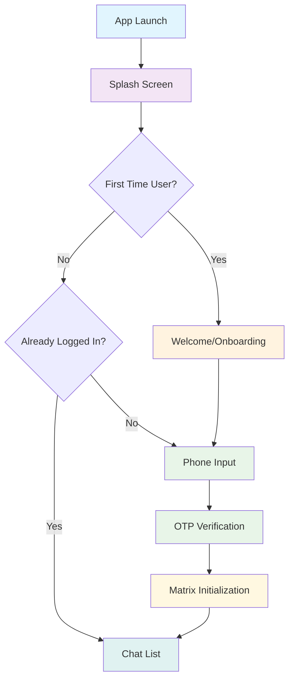

# Complete Matrix Chat App Implementation Guide

## 📋 Overview

This comprehensive guide provides everything needed to implement a complete Matrix-based chat application with secure authentication. The guide covers the entire user journey from splash screen to authenticated chat interface, based on the Dedi secure messaging platform implementation.

## 🚀 Complete User Journey



## 🏗️ Architecture Overview

```
┌─────────────────┐    ┌──────────────────┐    ┌─────────────────┐    ┌─────────────────┐
│   Splash Screen │───▶│ Welcome/Onboard  │───▶│   Phone Input   │───▶│  OTP Verification │
│                 │    │     Screen       │    │     Screen      │    │     Screen        │
└─────────────────┘    └──────────────────┘    └─────────────────┘    └──────────────────┘
         │                       │                       │                       │
         ▼                       ▼                       ▼                       ▼
┌─────────────────┐    ┌──────────────────┐    ┌─────────────────┐    ┌─────────────────┐
│  App Initialize │    │  User Onboarding │    │   Backend API   │    │ Matrix Client   │
│  State Check    │    │  Brand Introduction│   │  OTP Request    │    │ Initialization  │
└─────────────────┘    └──────────────────┘    └─────────────────┘    └─────────────────┘
```

## 📁 Directory Structure

```
login_flow/
├── README.md                          # This comprehensive guide
├── assets/                            # App assets and logos
│   ├── appLogo.png                   # Main app logo (192x192px)
│   ├── dedi_logo_light.png           # Light theme logo
│   └── splash_logo.png               # Splash screen logo
├── docs/                              # Complete documentation
│   ├── architecture.md               # System architecture
│   ├── splash_screen.md              # Splash screen implementation
│   ├── onboarding_welcome.md         # Welcome/onboarding screens
│   ├── complete_navigation_flow.md   # End-to-end navigation
│   └── flow_diagram.md               # Detailed flow diagrams
├── code_examples/                     # Production-ready code
│   ├── phone_input.dart              # Phone input screen
│   ├── otp_verification.dart         # OTP verification screen
│   ├── http_helper.dart              # Network communication
│   └── matrix_client.dart            # Matrix SDK integration
├── implementation_guides/             # Step-by-step tutorials
│   ├── step1_phone_input.md          # Phone input implementation
│   ├── step2_otp_verification.md     # OTP verification guide
│   ├── step3_matrix_integration.md   # Matrix client setup
│   └── step4_state_management.md     # State management patterns
├── api_specs/                         # Backend API documentation
│   ├── otp_endpoints.md              # OTP API endpoints
│   └── matrix_token_exchange.md      # Matrix token exchange
├── config_templates/                  # Configuration templates
│   ├── app_config.dart               # App configuration
│   ├── environment.dart              # Environment settings
│   └── routes.dart                   # Complete navigation routes
├── matrix_integration/                # Matrix SDK integration
│   ├── client_manager.dart           # Matrix client management
│   ├── authentication.md             # Matrix authentication guide
│   └── session_management.dart       # Session handling
└── troubleshooting/                   # Support documentation
    ├── common_errors.md              # Error handling guide
    └── best_practices.md             # Implementation best practices
```

## 🚀 Quick Start

### Complete Implementation Flow

1. **Understand the Architecture**: Start with `docs/architecture.md`
2. **Set Up Splash Screen**: Follow `docs/splash_screen.md` for app launch
3. **Implement Welcome Flow**: Use `docs/onboarding_welcome.md` for first-time users
4. **Build Authentication**: Follow `implementation_guides/` in order:
   - Phone input implementation
   - OTP verification system
   - Matrix client integration
   - State management setup
5. **Configure Navigation**: Use `docs/complete_navigation_flow.md`
6. **Copy Code Examples**: Adapt production-ready code from `code_examples/`
7. **Configure Your App**: Use templates in `config_templates/`
8. **Handle Errors**: Reference `troubleshooting/` for common issues

### For AI Tools and Developers

This documentation is optimized for AI-assisted development:
- **Copy-paste ready code** with complete implementations
- **Mermaid diagrams** for visual flow understanding
- **Comprehensive examples** covering all edge cases
- **Platform-specific guidance** for Android, iOS, and Web

## 🔐 Security Features

- **End-to-End Encryption**: Full Matrix protocol encryption
- **OTP Verification**: SMS-based phone number verification
- **JWT Tokens**: Secure token-based authentication
- **Cross-Signing**: Device verification and key management
- **Secure Storage**: Encrypted local storage for sensitive data

## 📱 Platform Support

- ✅ **Android**: Native implementation
- ✅ **iOS**: Native implementation
- ✅ **Web**: CORS-compliant implementation
- ✅ **Desktop**: Windows, macOS, Linux

## 🔧 Dependencies

### Core Dependencies
```yaml
dependencies:
  flutter: sdk: flutter
  matrix: ^2.0.1                 # Matrix SDK
  go_router: ^16.2.1            # Navigation
  provider: ^6.0.2              # State management
  shared_preferences: ^2.2.0    # Local storage
  http: ^1.5.0                  # HTTP client
```

### Platform-Specific
```yaml
  flutter_secure_storage: ^9.2.4  # Secure storage
  universal_html: ^2.2.4          # Web compatibility
  device_info_plus: ^12.1.0       # Device information
```

## 🌐 Backend Requirements

Your backend must provide these endpoints:
- `POST /otp/request` - Send OTP to phone number
- `POST /otp/verify` - Verify OTP code
- `POST /otp/matrix-token` - Exchange JWT for Matrix credentials

## 📚 Implementation Steps

### Step 0: App Launch & Splash
Set up the splash screen with proper branding and initialization
- Configure flutter_native_splash
- Implement app initialization logic
- Handle navigation routing based on user state

### Step 1: Welcome & Onboarding
Create welcoming first-time user experience
- Design welcome screen with app introduction
- Implement optional multi-page onboarding
- Handle user state persistence

### Step 2: Phone Input
Implement phone number collection with validation
- Turkish phone number format (+90)
- Input validation and formatting
- Backend OTP request integration

### Step 3: OTP Verification
Handle OTP input and verification with backend
- 6-digit OTP input with auto-focus
- Paste operation support
- JWT token exchange with backend

### Step 4: Matrix Integration
Initialize Matrix client with received credentials
- Exchange JWT for Matrix access token
- Create Matrix client instance
- Handle homeserver connection

### Step 5: State Management & Navigation
Manage authentication state across the app
- Persistent login state storage
- Complete navigation flow setup
- Error handling and recovery

## 🤝 Contributing

This guide is designed to be:
- **AI-Friendly**: Easy for AI tools to parse and understand
- **Copy-Paste Ready**: Code examples that work out of the box
- **Comprehensive**: All aspects covered in detail
- **Maintainable**: Clear structure for future updates

## 📄 License

This implementation guide is based on the Dedi project (AGPL-3.0 License).
Use these patterns and code examples to build your own Matrix-based chat application.

## 🔗 Related Links

- [Matrix Specification](https://spec.matrix.org/)
- [Flutter Documentation](https://flutter.dev/docs)
- [Matrix Dart SDK](https://pub.dev/packages/matrix)
- [Dedi Source Code](https://git.liberyus.com/dedi/dedi_mobile)

---
*This guide provides everything needed to implement a production-ready Matrix authentication system.*