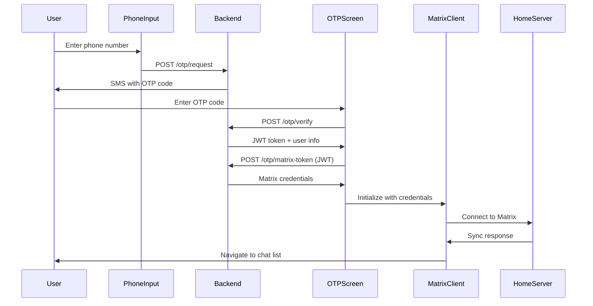

# Login Flow Architecture

## 🏛️ System Architecture Overview

The Matrix login flow in Dedi implements a sophisticated multi-layered authentication system that combines traditional OTP verification with Matrix protocol security.

## 🔄 Authentication Flow Sequence



## 🏗️ Component Architecture

### 1. Presentation Layer
- **PhoneInputPage**: Phone number collection and validation
- **OtpVerifyPage**: OTP code input and verification
- **Navigation**: Route management and redirects

### 2. Business Logic Layer
- **HttpHelper**: Network communication abstraction
- **Authentication Service**: Token management and validation
- **State Management**: Provider-based state handling

### 3. Data Layer
- **Matrix SDK**: Core Matrix protocol implementation
- **Secure Storage**: Encrypted credential storage
- **SharedPreferences**: App settings and preferences

### 4. Network Layer
- **Backend API**: Custom OTP and token exchange endpoints
- **Matrix HomeServer**: Standard Matrix protocol endpoints
- **CORS Handling**: Web-specific network configurations

## 🔐 Security Architecture

### Authentication Layers
1. **Phone Verification**: SMS-based identity verification
2. **JWT Authentication**: Secure token-based session management
3. **Matrix Protocol**: End-to-end encryption and device verification
4. **Local Security**: Encrypted storage and secure key management

### Token Flow
```
Phone Number → OTP → JWT Token → Matrix Credentials → Matrix Session
     ↓            ↓       ↓             ↓              ↓
  Identity    Verification Backend    HomeServer    E2E Encryption
```

## 🎯 Key Design Decisions

### 1. OTP-First Approach
- **Why**: User-friendly onboarding without complex Matrix ID requirements
- **How**: Phone number maps to Matrix ID automatically
- **Benefits**: Familiar UX, reduces friction, maintains security

### 2. JWT Bridge Pattern
- **Why**: Separate authentication domain from Matrix protocol
- **How**: Backend acts as identity provider for Matrix
- **Benefits**: Flexible auth methods, backend control, audit trails

### 3. Multi-Client Architecture
- **Why**: Support for multiple accounts and devices
- **How**: Client manager with account bundles
- **Benefits**: Power users, business accounts, device switching

### 4. Progressive Enhancement
- **Why**: Graceful degradation across platforms
- **How**: Platform-specific implementations with common interfaces
- **Benefits**: Consistent UX, optimal platform utilization

## 📱 Platform-Specific Considerations

### Mobile (Android/iOS)
- Native SMS handling and autofill
- Biometric authentication integration
- Background sync and push notifications
- Secure keychain/keystore usage

### Web
- CORS-compliant network requests
- Local storage security considerations
- PWA capabilities and offline support
- Browser-specific API handling

### Desktop
- Window management and system integration
- File system access and permissions
- Multi-instance handling
- System notifications

## 🔧 State Management Architecture

### Provider Pattern Implementation
```dart
Matrix (Root Provider)
├── Client Management
├── Authentication State
├── Navigation State
└── Theme/Settings

ChatListController (Screen Level)
├── Room Filtering
├── Search State
└── UI State

ChatController (Feature Level)
├── Message State
├── Timeline Management
└── Input State
```

### State Persistence
- **Authentication**: Secure storage for tokens and credentials
- **User Preferences**: SharedPreferences for app settings
- **Chat Data**: Matrix SDK internal storage (SQLCipher)
- **Draft Messages**: Temporary local storage

## 🚀 Performance Considerations

### Initialization Optimization
- Lazy loading of Matrix client
- Background initialization during OTP entry
- Preemptive token refresh
- Cached authentication state

### Memory Management
- Client instance reuse
- Timeline pagination
- Image caching and cleanup
- Background task management

### Network Optimization
- Request batching and queuing
- Retry mechanisms with backoff
- Connection pooling
- Bandwidth adaptation

## 🔄 Error Handling Strategy

### Layered Error Handling
1. **Network Level**: HTTP errors, timeouts, connectivity
2. **Authentication Level**: Invalid tokens, expired sessions
3. **Matrix Level**: Sync failures, encryption errors
4. **UI Level**: User-friendly error messages

### Recovery Mechanisms
- Automatic token refresh
- Graceful authentication retry
- Offline queue management
- User-initiated recovery options

## 📊 Monitoring and Analytics

### Key Metrics
- Authentication success/failure rates
- Time to first message
- Error frequency and types
- Platform-specific performance

### Debug Information
- Detailed logging at each layer
- Performance timing measurements
- Network request/response logging
- Matrix sync status tracking

## 🔮 Extensibility Points

### Custom Authentication Methods
- Additional OTP providers
- Social login integration
- Enterprise SSO support
- Biometric authentication

### Backend Integration
- Multiple homeserver support
- Custom identity providers
- Webhook integrations
- Analytics platforms

### UI Customization
- Theme system extension
- Custom components
- Localization support
- Accessibility enhancements

---

This architecture provides a solid foundation for building secure, scalable Matrix-based chat applications with excellent user experience across all platforms.