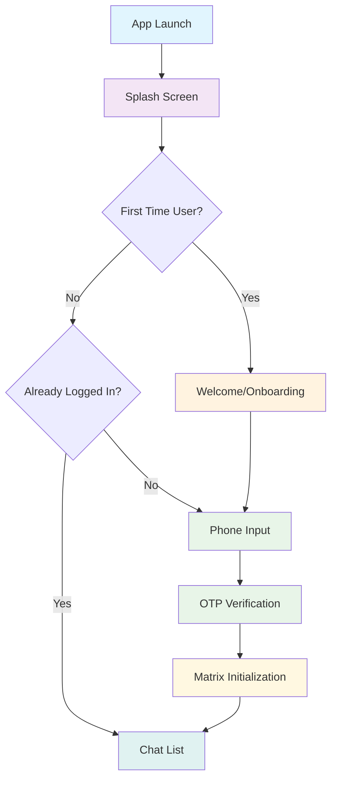
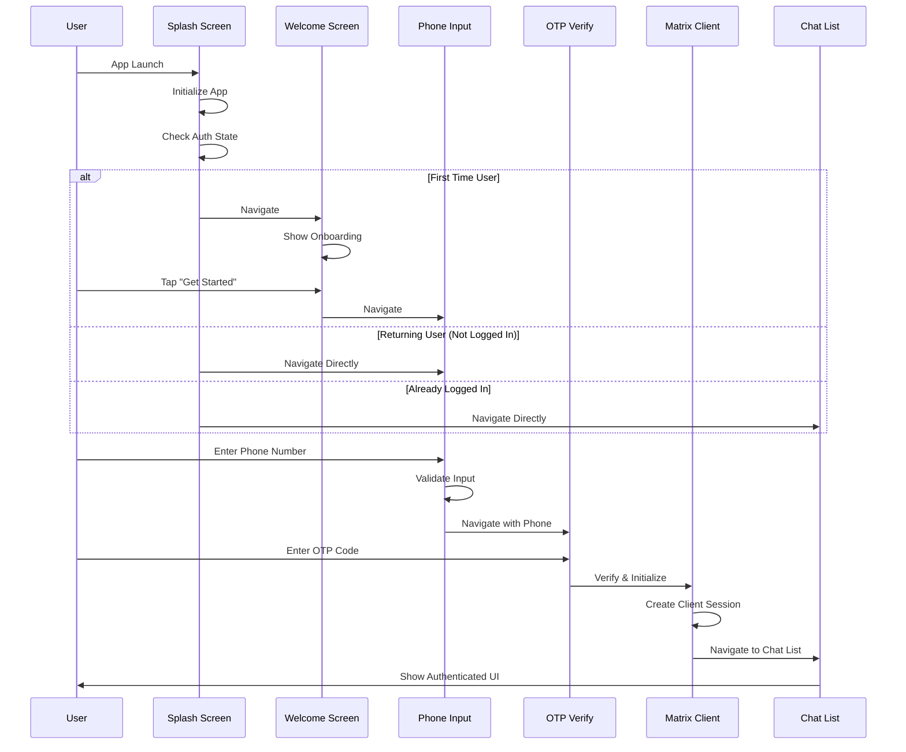

# Complete Navigation Flow: Splash → Onboarding → Authentication

## 📋 Overview

This document provides a complete guide to implementing the full user journey from app launch to authenticated chat interface. The flow includes splash screen, welcome/onboarding, phone verification, OTP confirmation, and Matrix client initialization.

## 🚀 Complete User Journey



## 🔄 State Management & Navigation Logic

### Main Navigation Controller

```dart
/// Complete Navigation Flow Controller
/// Manages the entire user journey from splash to chat

import 'package:flutter/material.dart';
import 'package:go_router/go_router.dart';
import 'package:shared_preferences/shared_preferences.dart';
import 'package:matrix/matrix.dart';

class AppNavigationController {
  /// Determine the correct initial route based on user state
  static Future<String> getInitialRoute() async {
    try {
      final prefs = await SharedPreferences.getInstance();

      // Check if user is logged in with valid Matrix session
      final isLoggedIn = prefs.getBool('is_logged_in') ?? false;
      final userId = prefs.getString('user_id');

      if (isLoggedIn && userId != null) {
        // Verify Matrix client can be restored
        final canRestore = await _canRestoreMatrixClient(userId);
        if (canRestore) {
          return '/rooms';
        } else {
          // Clear invalid session
          await _clearInvalidSession(prefs);
        }
      }

      // Check if user has completed onboarding
      final hasSeenOnboarding = prefs.getBool('has_seen_onboarding') ?? false;
      if (!hasSeenOnboarding) {
        return '/welcome';
      }

      // Return user - go to phone input
      return '/home/phone';
    } catch (e) {
      print('[Navigation] Error determining initial route: $e');
      return '/welcome';
    }
  }

  static Future<bool> _canRestoreMatrixClient(String userId) async {
    try {
      // Attempt to restore Matrix client
      // This would integrate with your Matrix client manager
      return await MatrixClientManager.canRestoreClient(userId);
    } catch (e) {
      print('[Navigation] Cannot restore Matrix client: $e');
      return false;
    }
  }

  static Future<void> _clearInvalidSession(SharedPreferences prefs) async {
    await prefs.remove('is_logged_in');
    await prefs.remove('user_id');
    await prefs.remove('matrix_access_token');
    print('[Navigation] Cleared invalid session data');
  }

  /// Handle successful authentication
  static Future<void> onAuthenticationSuccess({
    required BuildContext context,
    required String userId,
    required String accessToken,
    String? deviceId,
  }) async {
    try {
      // Save authentication state
      final prefs = await SharedPreferences.getInstance();
      await prefs.setBool('is_logged_in', true);
      await prefs.setString('user_id', userId);
      await prefs.setString('matrix_access_token', accessToken);
      if (deviceId != null) {
        await prefs.setString('device_id', deviceId);
      }

      // Mark onboarding as complete
      await prefs.setBool('has_seen_onboarding', true);

      // Navigate to chat list
      if (context.mounted) {
        context.go('/rooms');
      }
    } catch (e) {
      print('[Navigation] Error saving auth success: $e');
      rethrow;
    }
  }

  /// Handle logout
  static Future<void> onLogout(BuildContext context) async {
    try {
      // Clear all stored data
      final prefs = await SharedPreferences.getInstance();
      await prefs.clear();

      // Navigate back to welcome
      if (context.mounted) {
        context.go('/welcome');
      }
    } catch (e) {
      print('[Navigation] Error during logout: $e');
    }
  }
}
```

### Enhanced Router Configuration

```dart
/// Complete Router Configuration
/// Integrates all screens with proper navigation logic

import 'package:flutter/material.dart';
import 'package:go_router/go_router.dart';
import 'package:matrix/matrix.dart';

class AppRouter {
  static GoRouter createRouter() {
    return GoRouter(
      initialLocation: '/',
      routes: [
        // Splash Screen Route
        GoRoute(
          path: '/',
          pageBuilder: (context, state) => _buildPage(
            context,
            state,
            const SplashScreen(),
          ),
        ),

        // Welcome/Onboarding Routes
        GoRoute(
          path: '/welcome',
          pageBuilder: (context, state) => _buildPage(
            context,
            state,
            const WelcomeScreen(),
          ),
          routes: [
            GoRoute(
              path: 'onboarding',
              pageBuilder: (context, state) => _buildPage(
                context,
                state,
                const OnboardingScreen(),
              ),
            ),
          ],
        ),

        // Authentication Routes
        GoRoute(
          path: '/home',
          pageBuilder: (context, state) => _buildPage(
            context,
            state,
            const HomeserverPicker(addMultiAccount: false),
          ),
          redirect: _loggedInRedirect,
          routes: [
            GoRoute(
              path: 'phone',
              pageBuilder: (context, state) => _buildPage(
                context,
                state,
                const PhoneInputPage(),
              ),
              redirect: _loggedInRedirect,
            ),
            GoRoute(
              path: 'otp',
              pageBuilder: (context, state) => _buildPage(
                context,
                state,
                OtpVerifyPage(
                  phoneNumber: state.uri.queryParameters['phone'] ?? '',
                  devOtp: state.uri.queryParameters['dev_otp'],
                ),
              ),
              redirect: _loggedInRedirect,
            ),
          ],
        ),

        // Authenticated Routes
        GoRoute(
          path: '/rooms',
          pageBuilder: (context, state) => _buildPage(
            context,
            state,
            ChatList(
              activeChat: state.pathParameters['roomid'],
            ),
          ),
          redirect: _loggedOutRedirect,
          routes: [
            // Chat routes...
          ],
        ),
      ],
      errorPageBuilder: (context, state) => _buildPage(
        context,
        state,
        ErrorScreen(error: state.error),
      ),
    );
  }

  static Page _buildPage(BuildContext context, GoRouterState state, Widget child) {
    return MaterialPage(
      key: state.pageKey,
      restorationId: state.pageKey.value,
      child: child,
    );
  }

  static Future<String?> _loggedInRedirect(BuildContext context, GoRouterState state) async {
    final isLoggedIn = await _checkLoggedInStatus(context);
    return isLoggedIn ? '/rooms' : null;
  }

  static Future<String?> _loggedOutRedirect(BuildContext context, GoRouterState state) async {
    final isLoggedIn = await _checkLoggedInStatus(context);
    return isLoggedIn ? null : '/welcome';
  }

  static Future<bool> _checkLoggedInStatus(BuildContext context) async {
    try {
      final prefs = await SharedPreferences.getInstance();
      final isLoggedIn = prefs.getBool('is_logged_in') ?? false;
      final userId = prefs.getString('user_id');

      if (isLoggedIn && userId != null) {
        // Verify Matrix client is still valid
        return await MatrixClientManager.canRestoreClient(userId);
      }
      return false;
    } catch (e) {
      return false;
    }
  }
}
```

## 🎨 Enhanced Splash Screen with Navigation

```dart
/// Enhanced Splash Screen
/// Handles app initialization and navigation routing

import 'package:flutter/material.dart';
import 'package:flutter/services.dart';
import 'package:flutter_native_splash/flutter_native_splash.dart';
import 'package:go_router/go_router.dart';

class SplashScreen extends StatefulWidget {
  const SplashScreen({super.key});

  @override
  State<SplashScreen> createState() => _SplashScreenState();
}

class _SplashScreenState extends State<SplashScreen>
    with TickerProviderStateMixin {
  late AnimationController _fadeController;
  late Animation<double> _fadeAnimation;

  @override
  void initState() {
    super.initState();
    _initializeAnimations();
    _startAppInitialization();
  }

  void _initializeAnimations() {
    _fadeController = AnimationController(
      duration: const Duration(milliseconds: 1000),
      vsync: this,
    );

    _fadeAnimation = Tween<double>(
      begin: 0.0,
      end: 1.0,
    ).animate(CurvedAnimation(
      parent: _fadeController,
      curve: Curves.easeIn,
    ));

    _fadeController.forward();
  }

  Future<void> _startAppInitialization() async {
    try {
      // Ensure minimum splash duration for branding
      final initializationFuture = _initializeApp();
      final minimumDurationFuture = Future.delayed(const Duration(seconds: 2));

      // Wait for both to complete
      await Future.wait([initializationFuture, minimumDurationFuture]);

      // Remove native splash if present
      FlutterNativeSplash.remove();

      // Navigate to appropriate screen
      if (mounted) {
        final nextRoute = await AppNavigationController.getInitialRoute();
        context.go(nextRoute);
      }
    } catch (e) {
      print('[SplashScreen] Initialization error: $e');
      FlutterNativeSplash.remove();
      if (mounted) {
        context.go('/welcome');
      }
    }
  }

  Future<void> _initializeApp() async {
    // Initialize app configuration
    await AppConfig.initialize();

    // Initialize Matrix SDK
    await MatrixClientManager.initialize();

    // Load user preferences
    await UserPreferences.load();

    // Initialize analytics (optional)
    await Analytics.initialize();

    // Preload critical assets
    await _preloadAssets();
  }

  Future<void> _preloadAssets() async {
    final assets = [
      'assets/images/dedi_logo_light.png',
      'assets/appLogo.png',
      // Add other critical assets
    ];

    for (final asset in assets) {
      try {
        await precacheImage(AssetImage(asset), context);
      } catch (e) {
        print('[SplashScreen] Failed to preload asset $asset: $e');
      }
    }
  }

  @override
  Widget build(BuildContext context) {
    return Scaffold(
      backgroundColor: const Color(0xFF47C2FF),
      body: AnnotatedRegion<SystemUiOverlayStyle>(
        value: SystemUiOverlayStyle.light.copyWith(
          statusBarColor: Colors.transparent,
          systemNavigationBarColor: const Color(0xFF47C2FF),
        ),
        child: Center(
          child: FadeTransition(
            opacity: _fadeAnimation,
            child: Column(
              mainAxisAlignment: MainAxisAlignment.center,
              children: [
                // App Logo
                Container(
                  width: 120,
                  height: 120,
                  decoration: BoxDecoration(
                    borderRadius: BorderRadius.circular(24),
                    boxShadow: [
                      BoxShadow(
                        color: Colors.black.withOpacity(0.1),
                        blurRadius: 20,
                        offset: const Offset(0, 10),
                      ),
                    ],
                  ),
                  child: ClipRRect(
                    borderRadius: BorderRadius.circular(24),
                    child: Image.asset(
                      'assets/appLogo.png',
                      fit: BoxFit.cover,
                    ),
                  ),
                ),

                const SizedBox(height: 32),

                // App Name
                const Text(
                  'Dedi',
                  style: TextStyle(
                    color: Colors.white,
                    fontSize: 32,
                    fontWeight: FontWeight.bold,
                    letterSpacing: 1.2,
                  ),
                ),

                const SizedBox(height: 8),

                // Tagline
                Text(
                  'Secure Messaging',
                  style: TextStyle(
                    color: Colors.white.withOpacity(0.9),
                    fontSize: 16,
                    fontWeight: FontWeight.w400,
                  ),
                ),
              ],
            ),
          ),
        ),
      ),
    );
  }

  @override
  void dispose() {
    _fadeController.dispose();
    super.dispose();
  }
}
```

## 🔧 Integration with Phone Input and OTP

### Enhanced Phone Input with Navigation

```dart
/// Enhanced Phone Input Page
/// Integrated with complete navigation flow

class PhoneInputPage extends StatefulWidget {
  const PhoneInputPage({super.key});

  @override
  State<PhoneInputPage> createState() => _PhoneInputPageState();
}

class _PhoneInputPageState extends State<PhoneInputPage> {
  final _controller = TextEditingController();
  bool _loading = false;
  String _errorMessage = '';

  @override
  void initState() {
    super.initState();
    _markOnboardingComplete();
  }

  Future<void> _markOnboardingComplete() async {
    final prefs = await SharedPreferences.getInstance();
    await prefs.setBool('has_seen_onboarding', true);
  }

  Future<void> _requestOtp() async {
    if (_controller.text.trim().length < 10) {
      setState(() => _errorMessage = 'Geçerli bir telefon numarası giriniz');
      return;
    }

    setState(() {
      _loading = true;
      _errorMessage = '';
    });

    try {
      final phone = '+90${_controller.text.trim().replaceAll(RegExp(r'\D'), '')}';
      final data = await HttpHelper.sendOtpRequest(phone);

      if (mounted) {
        final devOtp = data['dev_otp'] as String?;
        context.go('/home/otp?phone=${Uri.encodeComponent(phone)}${devOtp != null ? '&dev_otp=$devOtp' : ''}');
      }
    } catch (e) {
      print('[PhoneInput] OTP request error: $e');
      setState(() => _errorMessage = 'Bağlantı hatası: ${e.toString()}');
    } finally {
      setState(() => _loading = false);
    }
  }

  @override
  Widget build(BuildContext context) {
    return Scaffold(
      backgroundColor: Colors.white,
      appBar: AppBar(
        title: const Text('Telefon Doğrulama'),
        centerTitle: true,
        elevation: 0,
        backgroundColor: Colors.white,
        foregroundColor: Colors.black,
        leading: IconButton(
          icon: const Icon(Icons.arrow_back),
          onPressed: () => context.go('/welcome'),
        ),
      ),
      body: SafeArea(
        child: Padding(
          padding: const EdgeInsets.all(24),
          child: Column(
            children: [
              const SizedBox(height: 40),

              // Progress Indicator
              LinearProgressIndicator(
                value: 0.5, // 50% progress
                backgroundColor: Colors.grey[200],
                valueColor: const AlwaysStoppedAnimation<Color>(Color(0xFF47C2FF)),
              ),

              const SizedBox(height: 40),

              // Title and description
              const Text(
                "Telefon Numaranızı Girin",
                style: TextStyle(
                  fontSize: 24,
                  fontWeight: FontWeight.bold,
                  color: Color(0xFF1D1D1D),
                ),
                textAlign: TextAlign.center,
              ),

              const SizedBox(height: 16),

              Text(
                "Size SMS ile bir doğrulama kodu göndereceğiz",
                style: TextStyle(
                  fontSize: 16,
                  color: Colors.grey[600],
                ),
                textAlign: TextAlign.center,
              ),

              const SizedBox(height: 40),

              // Phone input field
              TextField(
                controller: _controller,
                keyboardType: TextInputType.phone,
                enabled: !_loading,
                autofocus: true,
                decoration: InputDecoration(
                  labelText: "Telefon Numarası",
                  prefixText: "+90 ",
                  prefixStyle: const TextStyle(
                    color: Colors.black,
                    fontWeight: FontWeight.w500,
                  ),
                  border: OutlineInputBorder(
                    borderRadius: BorderRadius.circular(12),
                    borderSide: BorderSide(color: Colors.grey[300]!),
                  ),
                  focusedBorder: OutlineInputBorder(
                    borderRadius: BorderRadius.circular(12),
                    borderSide: const BorderSide(
                      color: Color(0xFF47C2FF),
                      width: 2,
                    ),
                  ),
                  errorText: _errorMessage.isEmpty ? null : _errorMessage,
                  contentPadding: const EdgeInsets.symmetric(
                    horizontal: 16,
                    vertical: 16,
                  ),
                ),
                onSubmitted: (_) => _requestOtp(),
              ),

              const Spacer(),

              // Continue button
              SizedBox(
                width: double.infinity,
                height: 52,
                child: ElevatedButton(
                  onPressed: _loading ? null : _requestOtp,
                  style: ElevatedButton.styleFrom(
                    backgroundColor: const Color(0xFF47C2FF),
                    foregroundColor: Colors.white,
                    shape: RoundedRectangleBorder(
                      borderRadius: BorderRadius.circular(12),
                    ),
                    elevation: 0,
                  ),
                  child: _loading
                      ? const SizedBox(
                          height: 20,
                          width: 20,
                          child: CircularProgressIndicator(
                            color: Colors.white,
                            strokeWidth: 2,
                          ),
                        )
                      : const Text(
                          "Doğrulama Kodu Al",
                          style: TextStyle(
                            fontSize: 16,
                            fontWeight: FontWeight.w600,
                          ),
                        ),
                ),
              ),

              const SizedBox(height: 16),

              // Back to welcome
              TextButton(
                onPressed: _loading ? null : () => context.go('/welcome'),
                child: const Text(
                  'Geri Dön',
                  style: TextStyle(
                    color: Color(0xFF47C2FF),
                    fontSize: 16,
                  ),
                ),
              ),
            ],
          ),
        ),
      ),
    );
  }

  @override
  void dispose() {
    _controller.dispose();
    super.dispose();
  }
}
```

### Enhanced OTP with Complete Flow

```dart
/// Enhanced OTP Verification
/// Integrates with complete authentication flow

class OtpVerifyPage extends StatefulWidget {
  final String phoneNumber;
  final String? devOtp;

  const OtpVerifyPage({
    super.key,
    required this.phoneNumber,
    this.devOtp,
  });

  @override
  State<OtpVerifyPage> createState() => _OtpVerifyPageState();
}

class _OtpVerifyPageState extends State<OtpVerifyPage> {
  final _controllers = List.generate(6, (_) => TextEditingController());
  final _focusNodes = List.generate(6, (_) => FocusNode());
  bool _loading = false;
  String _errorMessage = '';

  @override
  void initState() {
    super.initState();
    _autoFillDevOtp();
  }

  void _autoFillDevOtp() {
    if (widget.devOtp != null && widget.devOtp!.length == 6) {
      WidgetsBinding.instance.addPostFrameCallback((_) {
        for (int i = 0; i < 6; i++) {
          _controllers[i].text = widget.devOtp![i];
        }
        if (mounted) {
          ScaffoldMessenger.of(context).showSnackBar(
            SnackBar(
              content: Text('Dev OTP auto-filled: ${widget.devOtp}'),
              backgroundColor: Colors.orange,
            ),
          );
        }
      });
    }
  }

  Future<void> _verifyOtp() async {
    final code = _controllers.map((c) => c.text).join();
    if (code.length != 6) {
      setState(() => _errorMessage = 'Lütfen 6 haneli kodu eksiksiz giriniz');
      return;
    }

    setState(() {
      _loading = true;
      _errorMessage = '';
    });

    try {
      // Step 1: Verify OTP and get JWT
      final authData = await HttpHelper.verifyOtp(widget.phoneNumber, code);
      final jwtToken = authData['access_token'] as String;
      final mxid = authData['mxid'] as String;

      // Step 2: Exchange JWT for Matrix token
      final matrixData = await HttpHelper.getMatrixToken(
        jwtToken: jwtToken,
        phoneNumber: widget.phoneNumber,
      );

      // Step 3: Initialize Matrix client
      await MatrixClientManager.initializeClient(
        userId: matrixData['user_id'] as String,
        accessToken: matrixData['access_token'] as String,
        deviceId: matrixData['device_id'] as String?,
        homeserverUrl: _extractHomeserverUrl(mxid),
      );

      // Step 4: Save authentication state and navigate
      if (mounted) {
        await AppNavigationController.onAuthenticationSuccess(
          context: context,
          userId: matrixData['user_id'] as String,
          accessToken: matrixData['access_token'] as String,
          deviceId: matrixData['device_id'] as String?,
        );
      }
    } catch (e) {
      print('[OtpVerify] Error: $e');
      if (mounted) {
        setState(() => _errorMessage = _parseError(e.toString()));
      }
    } finally {
      if (mounted) {
        setState(() => _loading = false);
      }
    }
  }

  String _extractHomeserverUrl(String mxid) {
    final parts = mxid.split(':');
    return parts.length > 1 ? 'https://${parts.last}' : 'https://dedi.useitsoon.com';
  }

  String _parseError(String error) {
    if (error.contains('Invalid OTP')) {
      return 'Doğrulama kodu hatalı. Lütfen kontrol edin.';
    } else if (error.contains('expired')) {
      return 'Doğrulama kodu süresi dolmuş. Yeni kod isteyin.';
    }
    return 'Bağlantı hatası. Lütfen tekrar deneyin.';
  }

  @override
  Widget build(BuildContext context) {
    return Scaffold(
      backgroundColor: Colors.white,
      appBar: AppBar(
        title: const Text('Doğrulama'),
        backgroundColor: Colors.white,
        foregroundColor: Colors.black,
        elevation: 0,
        leading: IconButton(
          icon: const Icon(Icons.arrow_back),
          onPressed: () => context.go('/home/phone'),
        ),
      ),
      body: SafeArea(
        child: Padding(
          padding: const EdgeInsets.all(24),
          child: Column(
            children: [
              // Progress indicator
              LinearProgressIndicator(
                value: 1.0, // 100% progress
                backgroundColor: Colors.grey[200],
                valueColor: const AlwaysStoppedAnimation<Color>(Color(0xFF47C2FF)),
              ),

              const SizedBox(height: 40),

              // Title and description
              const Text(
                'Onay Kodunu Girin',
                style: TextStyle(
                  fontSize: 24,
                  fontWeight: FontWeight.bold,
                  color: Color(0xFF1D1D1D),
                ),
              ),

              const SizedBox(height: 16),

              Text(
                '${widget.phoneNumber} numarasına gönderilen 6 haneli kodu girin',
                textAlign: TextAlign.center,
                style: TextStyle(
                  fontSize: 16,
                  color: Colors.grey[600],
                  height: 1.4,
                ),
              ),

              const SizedBox(height: 40),

              // OTP input fields
              Row(
                mainAxisAlignment: MainAxisAlignment.spaceEvenly,
                children: List.generate(6, (index) {
                  return OtpDigitField(
                    controller: _controllers[index],
                    focusNode: _focusNodes[index],
                    onChanged: (value) => _onCodeChanged(index, value),
                    isActive: _focusNodes[index].hasFocus,
                  );
                }),
              ),

              const SizedBox(height: 40),

              // Error message
              if (_errorMessage.isNotEmpty) ...[
                Container(
                  padding: const EdgeInsets.all(12),
                  decoration: BoxDecoration(
                    color: Colors.red[50],
                    borderRadius: BorderRadius.circular(8),
                    border: Border.all(color: Colors.red[200]!),
                  ),
                  child: Row(
                    children: [
                      Icon(Icons.error_outline, color: Colors.red[600]),
                      const SizedBox(width: 8),
                      Expanded(
                        child: Text(
                          _errorMessage,
                          style: TextStyle(color: Colors.red[700]),
                        ),
                      ),
                    ],
                  ),
                ),
                const SizedBox(height: 24),
              ],

              const Spacer(),

              // Verify button
              SizedBox(
                width: double.infinity,
                height: 52,
                child: ElevatedButton(
                  onPressed: _loading ? null : _verifyOtp,
                  style: ElevatedButton.styleFrom(
                    backgroundColor: const Color(0xFF47C2FF),
                    foregroundColor: Colors.white,
                    shape: RoundedRectangleBorder(
                      borderRadius: BorderRadius.circular(12),
                    ),
                    elevation: 0,
                  ),
                  child: _loading
                      ? const SizedBox(
                          height: 20,
                          width: 20,
                          child: CircularProgressIndicator(
                            color: Colors.white,
                            strokeWidth: 2,
                          ),
                        )
                      : const Text(
                          'Doğrula',
                          style: TextStyle(
                            fontSize: 16,
                            fontWeight: FontWeight.w600,
                          ),
                        ),
                ),
              ),
            ],
          ),
        ),
      ),
    );
  }

  void _onCodeChanged(int index, String value) {
    // Handle input changes and auto-focus
    if (value.isNotEmpty && index < 5) {
      _focusNodes[index + 1].requestFocus();
    }
    if (value.isEmpty && index > 0) {
      _focusNodes[index - 1].requestFocus();
    }

    // Auto-verify when complete
    if (_controllers.every((c) => c.text.isNotEmpty)) {
      Future.delayed(const Duration(milliseconds: 300), () {
        if (mounted) _verifyOtp();
      });
    }
  }

  @override
  void dispose() {
    for (final controller in _controllers) {
      controller.dispose();
    }
    for (final focusNode in _focusNodes) {
      focusNode.dispose();
    }
    super.dispose();
  }
}
```

## 📊 Complete Flow Sequence Diagram



## 🔧 Error Handling & Recovery

### Global Error Handler

```dart
class AppErrorHandler {
  static void handleNavigationError(BuildContext context, String error) {
    print('[Navigation] Error: $error');

    ScaffoldMessenger.of(context).showSnackBar(
      SnackBar(
        content: Text('Navigation error: $error'),
        backgroundColor: Colors.red,
        action: SnackBarAction(
          label: 'Retry',
          onPressed: () => context.go('/welcome'),
        ),
      ),
    );
  }

  static Future<void> recoverFromError(BuildContext context) async {
    try {
      // Clear potentially corrupted state
      final prefs = await SharedPreferences.getInstance();
      await prefs.remove('is_logged_in');
      await prefs.remove('user_id');

      // Navigate to safe state
      if (context.mounted) {
        context.go('/welcome');
      }
    } catch (e) {
      print('[Error Recovery] Failed: $e');
    }
  }
}
```

## 📱 Testing the Complete Flow

### Integration Test Example

```dart
testWidgets('Complete authentication flow', (WidgetTester tester) async {
  // Test the entire flow from splash to chat
  await tester.pumpWidget(const DediApp());

  // Verify splash screen
  expect(find.byType(SplashScreen), findsOneWidget);

  // Wait for navigation
  await tester.pumpAndSettle(const Duration(seconds: 3));

  // Should show welcome for first-time user
  expect(find.byType(WelcomeScreen), findsOneWidget);

  // Tap get started
  await tester.tap(find.text('Get Started'));
  await tester.pumpAndSettle();

  // Should show phone input
  expect(find.byType(PhoneInputPage), findsOneWidget);

  // Enter phone number
  await tester.enterText(find.byType(TextField), '5551234567');
  await tester.tap(find.text('Doğrulama Kodu Al'));
  await tester.pumpAndSettle();

  // Should show OTP screen
  expect(find.byType(OtpVerifyPage), findsOneWidget);

  // Complete the flow...
});
```

This comprehensive navigation flow ensures a smooth, professional user experience from app launch to authenticated chat interface, with proper error handling and state management throughout the journey.