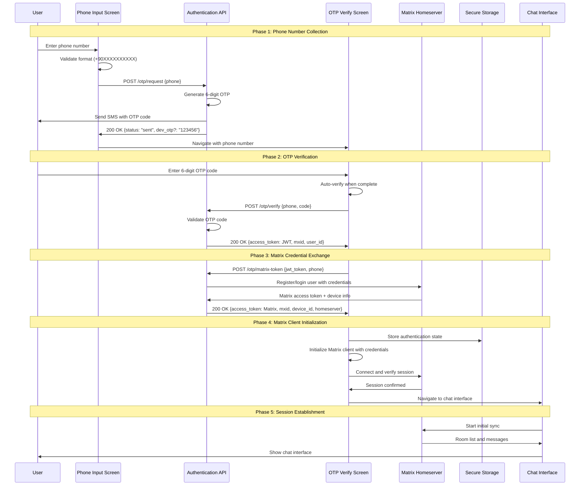
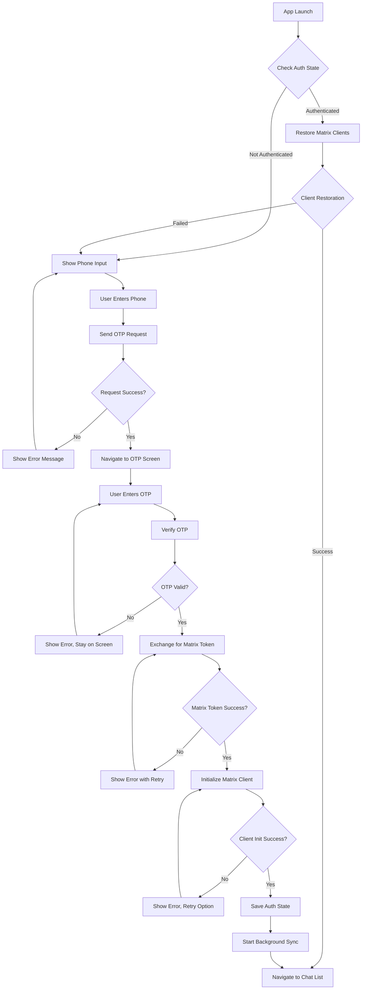
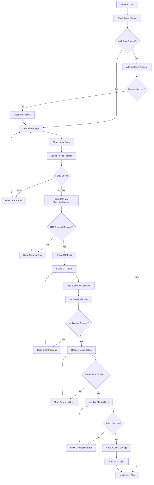
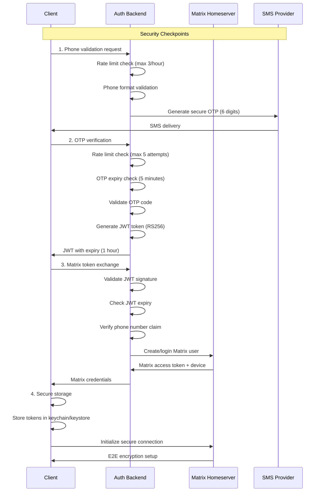
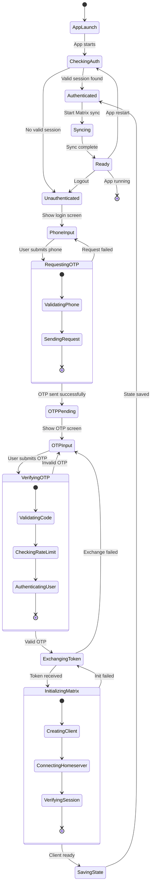
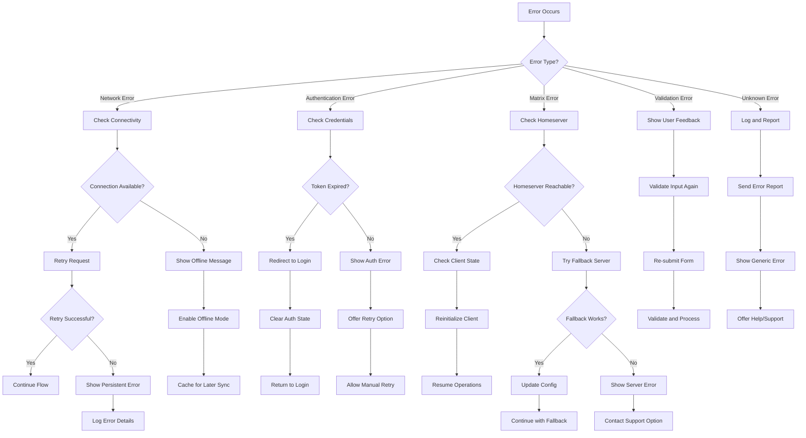
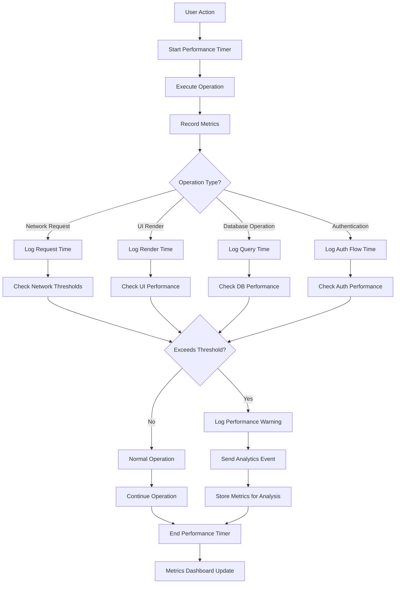
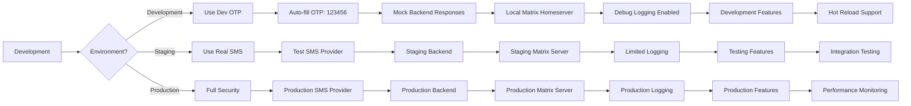
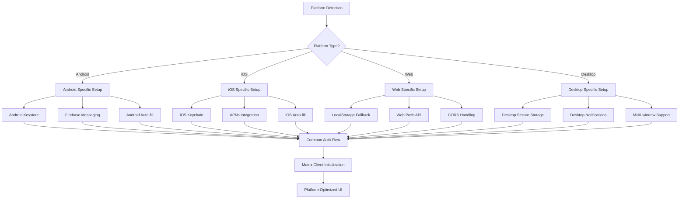

# Detailed Authentication Flow Diagrams

## 📋 Overview

This document provides comprehensive flow diagrams for the Matrix authentication system, including sequence diagrams, state transitions, and error handling flows.

## 🔄 Main Authentication Sequence



## 📱 Platform-Specific Flows

### Mobile App Flow



### Web App Flow



## 🔒 Security Flow Diagram



## 🔄 State Transition Diagram



## ❌ Error Handling Flow



## 🔄 Retry Logic Flow

```mermaid
sequenceDiagram
    participant Client
    participant RetryManager
    participant API
    participant UI

    Client->>RetryManager: Request with retry config
    RetryManager->>API: Initial request
    API->>RetryManager: Error response

    loop Retry Attempts
        RetryManager->>RetryManager: Calculate backoff delay
        RetryManager->>UI: Show retry indicator
        RetryManager->>RetryManager: Wait (exponential backoff)
        RetryManager->>API: Retry request

        alt Success
            API->>RetryManager: Success response
            RetryManager->>Client: Return success
            RetryManager->>UI: Hide retry indicator
        else Retryable Error
            API->>RetryManager: Retryable error
            Note over RetryManager: Continue retry loop
        else Non-retryable Error
            API->>RetryManager: Fatal error
            RetryManager->>Client: Return error
            RetryManager->>UI: Show error message
            break
        end
    end

    RetryManager->>Client: Max retries exceeded
    RetryManager->>UI: Show final error
```

## 📊 Performance Monitoring Flow



## 🔧 Development Flow



## 📱 Multi-Platform Considerations



These diagrams provide a comprehensive visual representation of the authentication flow, helping developers understand the system architecture and implement the solution correctly.